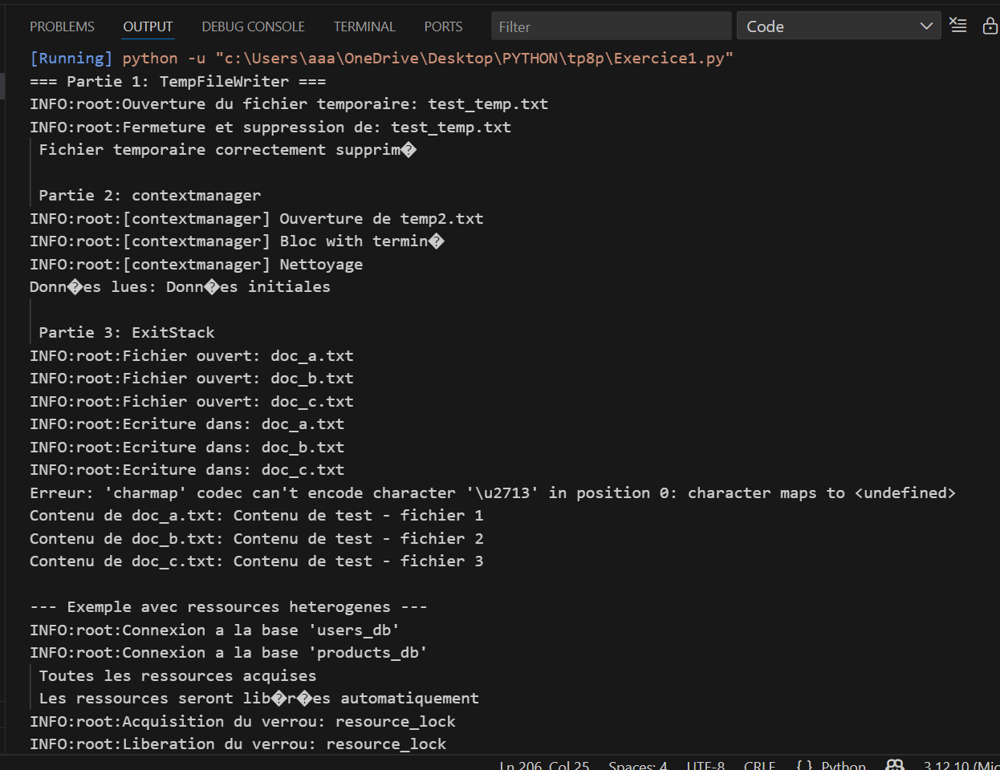
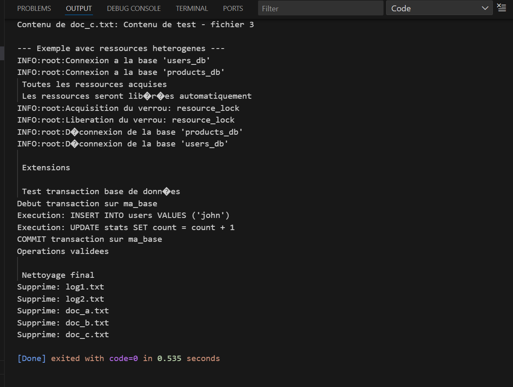
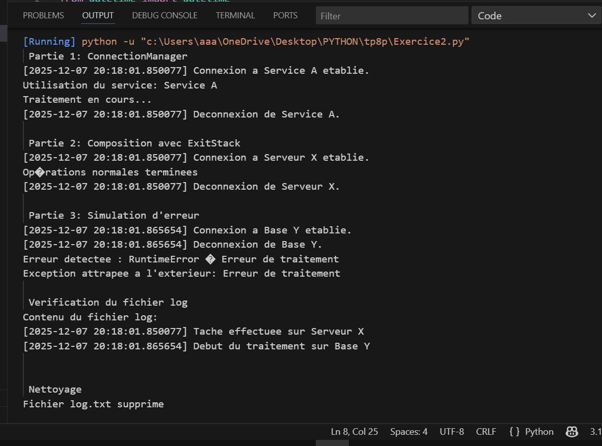
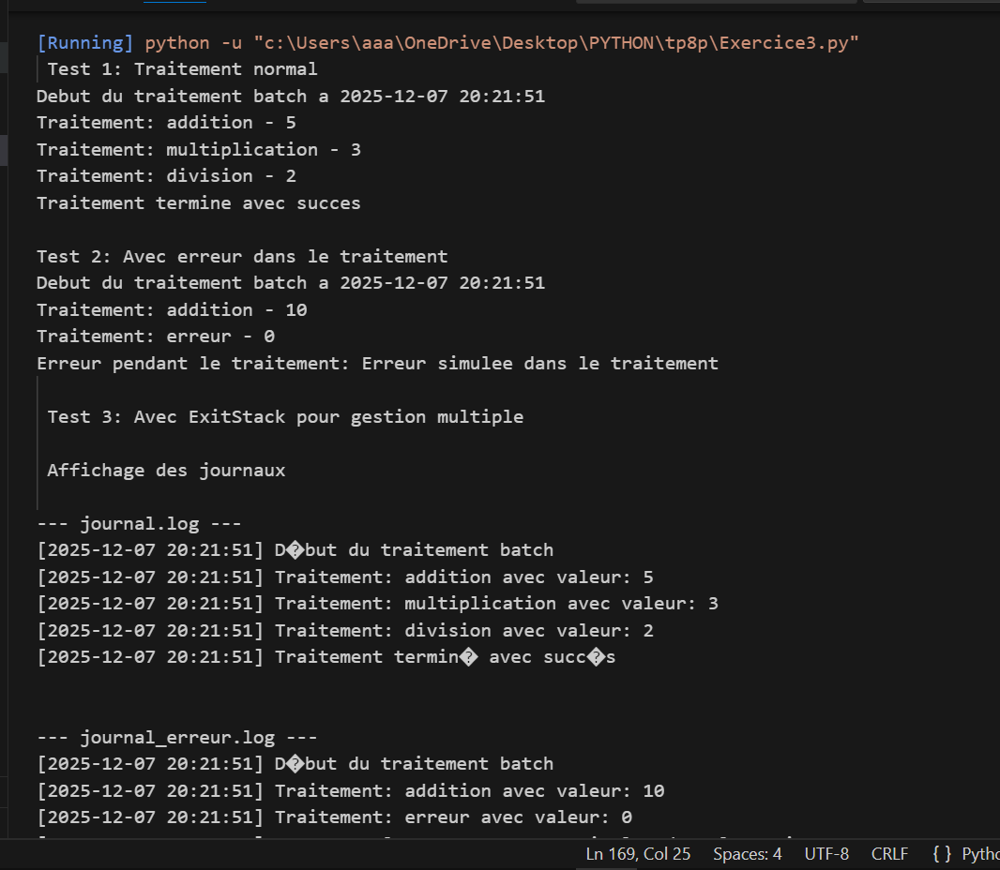
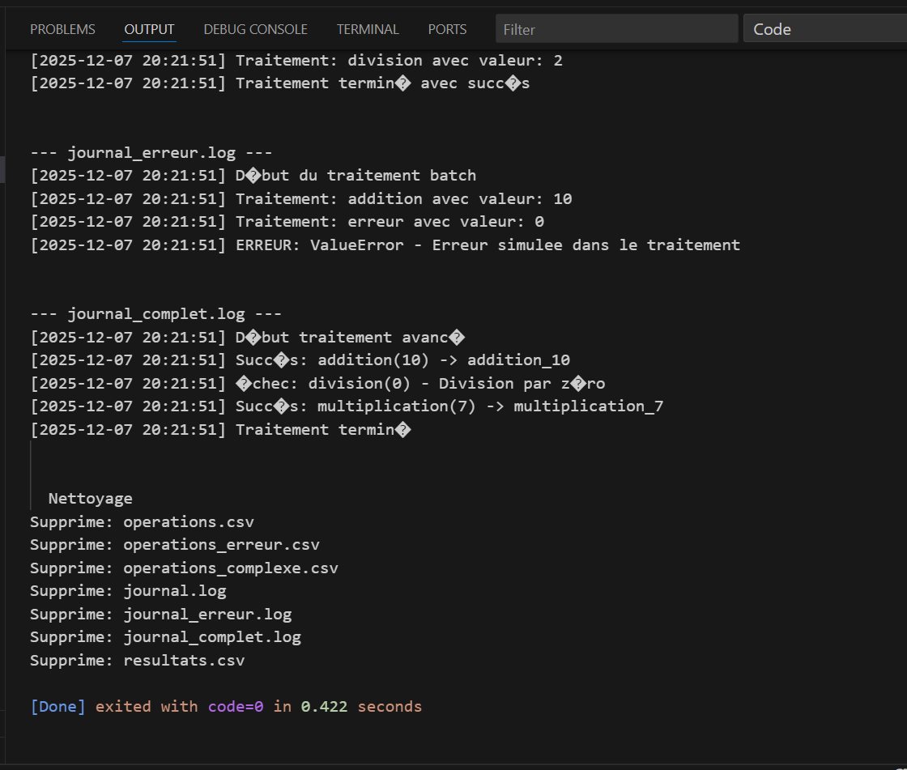

"# TP8_python" 
# 🧠 TP8 - Programmation PYTHON

Ce projet contient les exercices du TP8 en Python.

## 📸 Captures d’écran

Voici les résultats d’exécution :

Exécution D'EXERCICE 1 : 




Exécution D'EXERCICE 2 :



Exécution D'EXERCICE 3 :



---

## ⚙️ Compilation
```bash
g++ main.cpp -o main
./main


"# TP8_python" 
